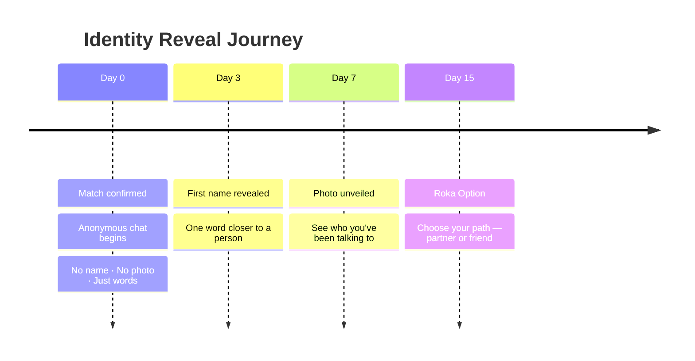
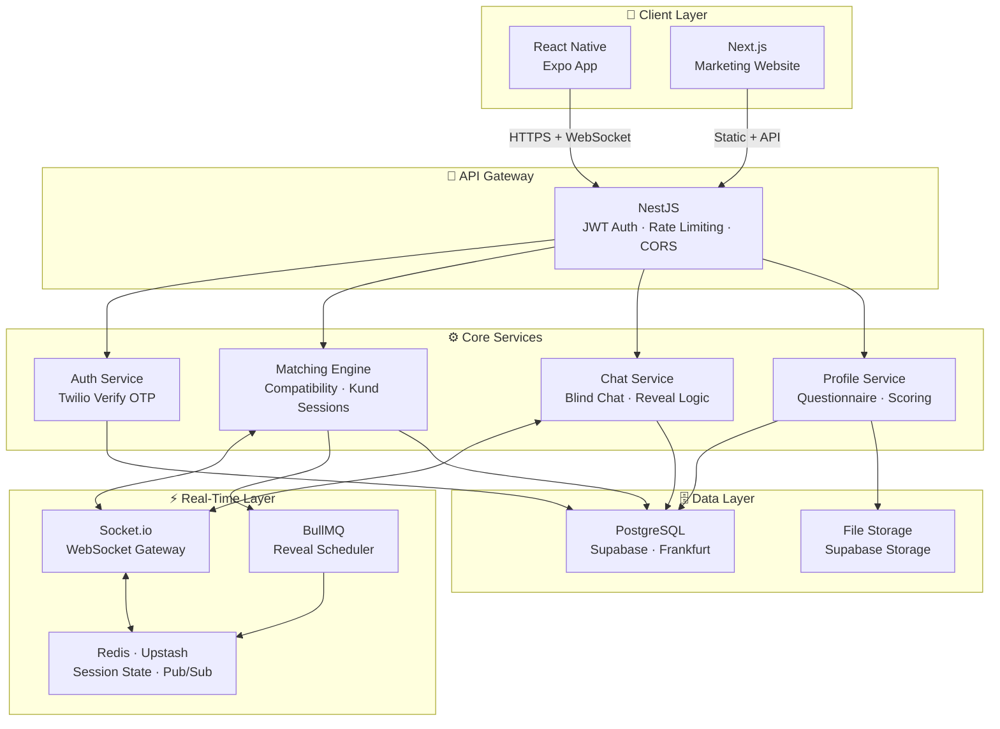
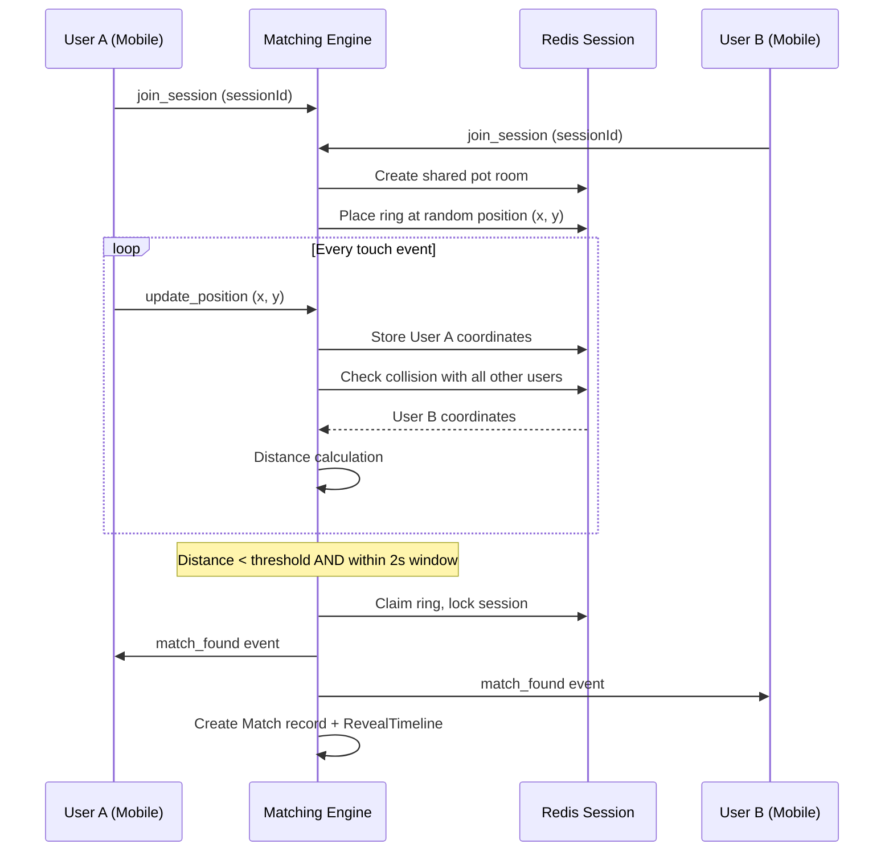
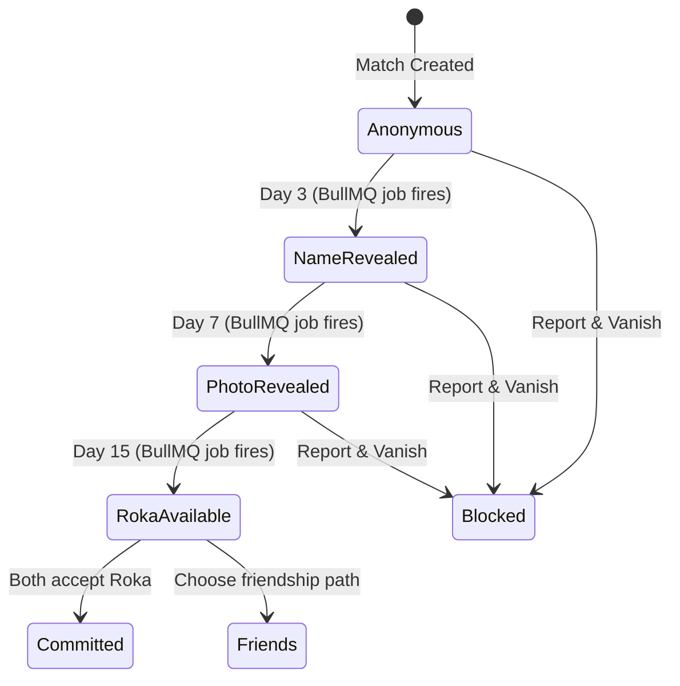
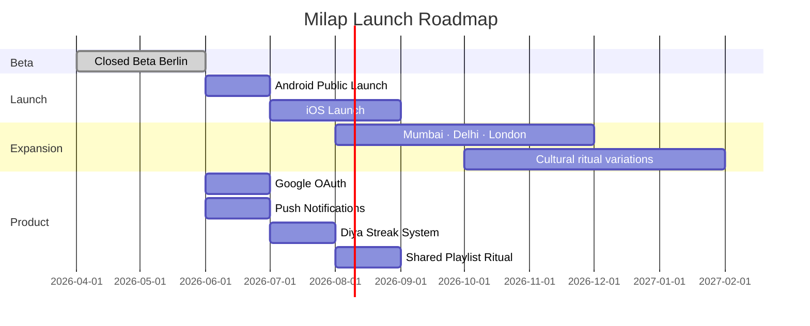

# 🪬 Milap — The Ancient Ritual, Reborn for The World

**A blind matching ritual for the whole world**

> *Milap replaces mindless swiping with a sacred game — two compatible souls searching the same milk for one ring. No photos. No names. Just intention.*

---

## 📌 What is Milap?

Milap is a global dating app built around an ancient Indian wedding ritual — the **ring-in-milk ceremony** — where the bride and groom search together for a hidden ring. Whoever finds it first "wins." Milap translates this into a blind digital matching experience: two compatible users search a shared virtual pot simultaneously. When they find the same ring — it's a match.

No photos before matching. No names. No swiping. Just a daily 30-minute ritual at 9PM, powered by compatibility science and cultural soul.

**Closed Beta · Berlin 2026 · Solo Founded · Seed Stage**

---

## 🔴 The Problem — Dating Apps Are Broken

Modern dating apps have optimized for engagement, not connection:

| Pain Point | Reality |
|---|---|
| **Judged in 0.3 seconds** | Photos dominate decisions before any human quality is considered |
| **Infinite swiping** | Gamified for dopamine, not for depth |
| **Ghost culture** | No accountability, no ritual, no commitment signal |
| **Superficiality spiral** | The most attractive profiles win, not the most compatible people |

The data is clear: **despite billions of swipes, loneliness is rising.** Dating apps have become entertainment products, not connection products.

---

## 💡 Milap's Contrarian Approach

Milap makes three bets that go against every major dating app:

1. **Blind before beautiful** — Compatibility is calculated silently. You never see a photo before matching.
2. **Slow reveal over instant gratification** — Names on Day 3. Photos on Day 7. Commitment on Day 15.
3. **Daily ritual over infinite scroll** — The Kund opens once a day, for 30 minutes. Scarcity creates intention.

**Cultural angle:** The ring-in-milk ritual is recognized across South Asia and the Indian diaspora — but Milap is built for the whole world. The symbolism is universal: searching together, finding together, choosing together.

---

## 🔄 The Product — 4-Step Ritual Flow

---

## 🌹 Progressive Reveal Timeline

---

## 🏗️ System Architecture

---

## 🛠️ Tech Stack — Reasoning Behind Each Choice

| Technology | Role | Why This Choice |
|---|---|---|
| **NestJS** | Backend Framework | Modular architecture, TypeScript-first, decorator-based guards perfect for multi-service auth |
| **React Native + Expo** | Mobile App | Cross-platform with single codebase, EAS Build for Play Store submission, familiar React paradigm |
| **Next.js** | Marketing Website | SSR for SEO, App Router, Vercel deployment in one click |
| **PostgreSQL via Supabase** | Primary Database | Relational model fits the complex match/reveal/message relationships; Supabase adds RLS for privacy |
| **Prisma ORM** | Database Layer | Type-safe queries, migration management, schema-as-code |
| **Redis via Upstash** | Ephemeral State | Pot session state, real-time position tracking, rate limiting — needs sub-millisecond access |
| **Socket.io** | Real-Time Engine | Reliable WebSocket with fallback, room-based architecture perfect for shared Kund sessions |
| **BullMQ** | Job Scheduling | Delayed jobs for reveal timeline (Day 3, 7, 15) — reliable, Redis-backed |
| **Twilio Verify** | OTP Authentication | Phone-number-first auth, global coverage, no phone number storage needed |
| **TypeScript** | Type Safety | End-to-end type safety across backend and frontend reduces integration bugs |

---

## ⚙️ Core Engineering Decisions

### 1. Blind Matching Engine
The core constraint: **users must never be identifiable before a match.** This required designing the entire data model around anonymity:
- Pot sessions store only internal `userId` — no names, no photos in session state
- Ring positions are server-generated and stored in Redis per session
- Touch coordinates never reach the database — only match outcomes do
- Even post-match, profile data is gated by the reveal timeline state machine

### 2. Compatibility Scoring
Before entering the Kund, users answer 5 calibrated questions. Responses are converted into a vector and scored against other users using **cosine similarity**. Only pairs scoring above a defined threshold are pooled into the same Kund session. The magic feels serendipitous — the math is intentional.

The 5 questions target:
- Core values alignment
- Lifestyle compatibility  
- Communication style
- Long-term commitment orientation
- Social energy levels

### 3. Daily Window Implementation
The 9PM window is not just a product decision — it's an engineering constraint. A BullMQ cron job fires at 8PM to:
1. Create the day's `PotSession` record
2. Pre-compute the eligible user pool into Redis cache
3. Queue push notifications

At 9PM, compatible users are silently pooled. At 9:30PM, the session closes. Thundering herd mitigation: users are staggered by timezone (Mumbai 9PM → Berlin 9PM → New York 9PM).

### 4. Real-Time Ring Collision Detection
Both users' touch coordinates stream via WebSocket to a shared Redis-backed session. The server performs lightweight collision detection — if two users' coordinates land within a defined radius of the same ring within a 2-second window, a match event fires simultaneously to both clients via Redis pub/sub.

### 5. Privacy-First Architecture
- **Photos**: Stored in private Supabase Storage buckets. Never publicly accessible. Served only via time-limited signed URLs generated server-side — and only after the Day 7 reveal condition is met.
- **Phone numbers**: Verified via Twilio, never stored in plaintext in the application database.
- **Messages**: Encrypted at rest. The server never processes plaintext message content beyond delivery.
- **Block mechanism**: Silent vanish — the blocker's experience changes instantly; the blocked user receives no notification.

---

## 🔮 The Kund Matching Algorithm — Conceptual

---

## 🎭 Progressive Identity Reveal — State Machine

Each state transition:
- Updates the `RevealTimeline` record in PostgreSQL
- Triggers a push notification to both users
- Changes what the API returns for `/profile/:matchId/reveal`
- The frontend reads reveal stage and renders accordingly — the backend enforces it, not the client

---

## 🎯 Product Design Decisions

### Why 30 Minutes?
Scarcity creates intention. A 30-minute daily window signals: *"This matters enough to show up for."* It also prevents the app from becoming a passive scroll — you either enter the Kund tonight, or you wait until tomorrow. This commitment signal self-selects for users who are serious.

### Why 9PM?
Behaviorally, evening is the highest-intention window for social connection. Post-work, pre-sleep — when people are most reflective and emotionally available. Culturally, evening rituals are deeply embedded in South Asian household rhythms. 9PM also creates a shared global moment — even across timezones, the *feeling* of "the Kund is open tonight" is synchronous.

### Why Slow Reveal?
The fastest path to disappointment in modern dating is photo-first judgment. Slow reveal forces conversation to carry the relationship for the first week. By the time photos are exchanged, both users have invested enough emotional capital that appearance becomes one factor — not the only factor. This is validated by decades of research on parasocial bonds and attachment formation.

### Why 5 Questions and Not 50?
Five questions answered honestly outperform fifty answered carelessly. The questionnaire is designed to be completed in under 3 minutes — low friction for high signal. Each question targets a distinct compatibility dimension. The cosine similarity model rewards alignment, not identity — two people can score high without being identical.

---

## 🚀 Deployment & Infrastructure

| Layer | Service | Reason |
|---|---|---|
| **Backend** | Railway | Zero-config NestJS deployment, GitHub CI/CD, environment variables UI |
| **Database** | Supabase (Frankfurt) | EU data residency, managed Postgres, built-in storage, RLS |
| **Cache/Queue** | Upstash Redis | Serverless Redis, no cold starts, pay-per-request at MVP scale |
| **Marketing Website** | Vercel | Next.js native, instant deploys, global CDN, custom domain |
| **Mobile** | Expo EAS | Managed build pipeline, OTA updates, Play Store submission |
| **SMS/OTP** | Twilio Verify | Global coverage, no phone number storage, compliant |

---

## 📊 Key Metrics & Status

| Metric | Value |
|---|---|
| Waitlist Signups | 2,400+ (pre-launch) |
| Beta Status | Closed Beta, Berlin 2026 |
| Founding Model | Solo Founded |
| Stage | Seed Stage |
| Mobile Platform | Android (Google Play — Closed Testing) |
| Backend Uptime | Railway managed |
| Website | [milap-eta.vercel.app](https://milap-eta.vercel.app) |

---

## 🧠 What I Learned Building Milap

**Solo founding a product with cultural soul is a different kind of hard.**

Most technical challenges have Stack Overflow answers. The hard problems in Milap were design problems disguised as technical ones:

- *How do you make anonymity feel magical, not eerie?* — Every UI decision, from blurred avatars to the "?" placeholder, had to communicate safety, not absence.
- *How do you build a real-time game that feels like a ritual?* — WebSocket latency and collision detection are engineering problems. Making them feel sacred is a design problem.
- *How do you build for slowness in a fast culture?* — Every product instinct says: give users more, faster. Milap's entire bet is the opposite. Resisting that instinct required constant conviction.

**On technical growth:** Building Milap end-to-end — from Prisma schema design to Socket.io collision detection to EAS build pipelines — forced a level of full-stack ownership that tutorials cannot replicate. Every architectural decision had a consequence I had to live with.

---

## 🗺️ Roadmap

---

## ✍️ Founder Note

> *"I built Milap to prove that Indian symbolism can meet global product craft — not as nostalgia, but as a new interface for intention. Dating apps taught us to judge fast. Milap asks you to wait, to search, to find — together. That patience is the product."*
>
> — **Saurabh Kumar**, Founder & CEO

**Saurabh Kumar**
Founder & CEO, Milap
MSc Artificial Intelligence, BSBI Berlin
B.Tech, CUSAT Kerala
Ex-Technical Head @ Pashi Technology · Full Stack Developer · Data Analyst
Previously built **Vocaa** — a language learning platform

*Milap is a solo-founded startup built with code, culture, and conviction.*

---

## 📬 Contact & Links

**📍 Berlin, Germany · Open to Werkstudent & Full-Stack Engineer roles**

---

*© 2026 Milap · Made with 🪬 in Berlin, Germany*
*Solo founded · Seed stage · The Kund opens at 9PM*

